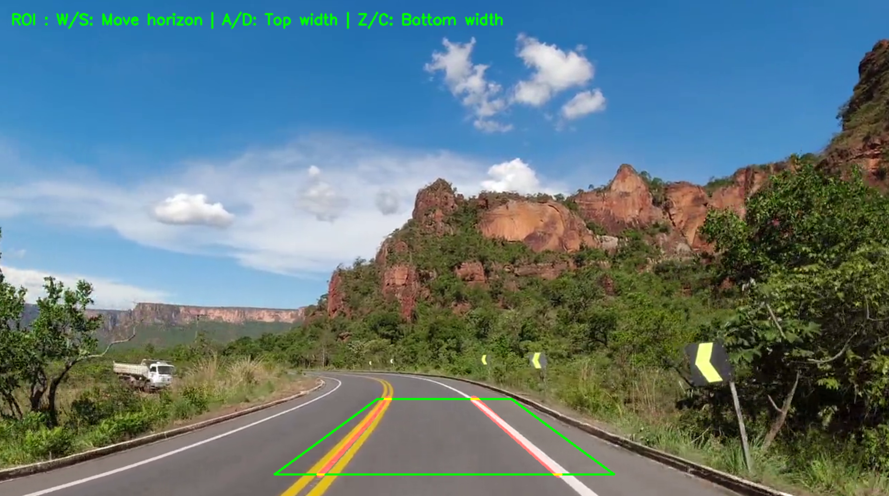

# Lane Detection for Self-Driving

**Project Date:** December 2021

This project implements a **lane detection algorithm** for a self-driving system using the **Hough Line Transform** in OpenCV.  

**Dynamic ROI (Region of Interest)** adjustment using keyboard input.  
Video from Pixabay (*Kililla*).

## Hough Line Transform

The **Hough Line Transform** is an algorithm used to detect straight lines in an image.  
It works by converting edge points (detected with Canny, for example) from **image space** into **parameter space** (ρ, θ).

1. Each pixel votes for possible lines passing through it.  
2. The peaks in the accumulator space correspond to the most probable lines.  
3. These detected lines are then drawn back on the image.

## Example video
🎥 [Watch on YouTube](https://www.youtube.com/watch?v=o-lD5uRsBHU)

HoughLines combined with YOLO-based object detection.
You can find it in the dev folder, but it’s not ready for external use.